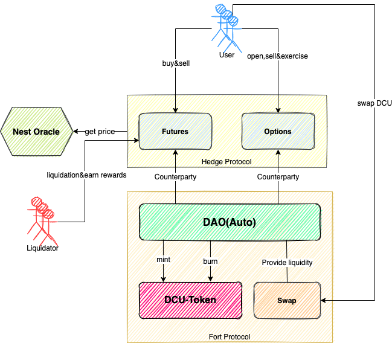

# System Data Model

---

### System Structure Diagram

### System operation process

1. DAO finances 30 million NEST from early developers, community KOLs, etc. for SWAP initial liquidity with a 1:1 consideration, while DAO injects 30 million DCU into SWAP, forming a pool of 30 million NEST: 30 million DCU. Users get DCU Token through SWAP transactions, which currently supports ETH<=>DCU and NEST<=>DCU.

2. Users can choose options or buy perpetual contracts, choose 2 directions of call or put, pay with DCU and get option or perpetual contract positions.

3. Options, the user can sell the option to the system at any time and receive DCUs, or exercise the option after the exercise date. The sale or exercise will invoke the NEST Price Oracle for settlement.

4. Perpetual contract, when the position net asset is below a certain amount, it will trigger liquidation, any third party can initiate debt position liquidation to the system, after successful liquidation, the position will be destroyed, and the liquidator can get certain remaining DCU of the liquidated position as liquidation reward.