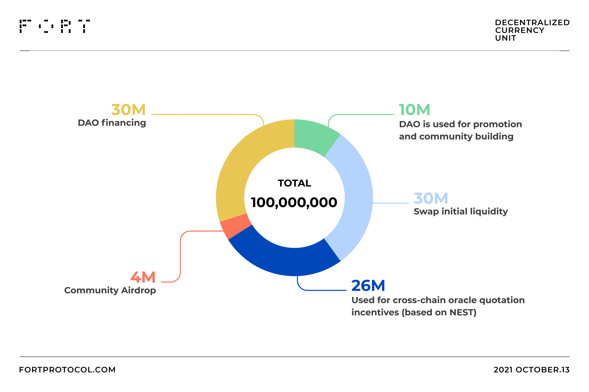

# Initial Issue

---

Initial Issue: 100 million DCU

1. 30 million DCU: DAO financing 30 million DCU = 30 million NEST for swap liquidity
2. 30 million DCU: Swap initial liquidity, 30 million NEST + 30 million DCU
3. 4 million DCU: Locked NEST community airdrop of 4 million
4. 10 million DCU: DAO for promotion and community building
5. 26 million DCU: used for cross-chain oracle offer incentive (based on NEST model)

