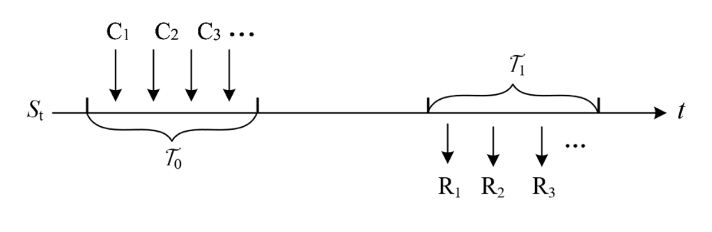

# FORT: A DeFi Development and Application System with Unlimited Liquidity

> James Zhao, September 9, 2021

---

##  FORT Principle

Any financial service or financial product can be abstracted as the interchange of future
revenue flow and current expenditure flow exchange, which is illustrated as follows

where

- $$S_{t}$$ is the price or interest rate information flow
- $$R_{i}$$ is revenue flow
- $$C_{i}$$ is expense flow
- $$\tau_{0}$$ is the time domain of expenses
- $$\tau_{1}$$ is the time domain of revenue

The principle of FORT is that, according to a given discounting algorithm, future
revenue flows and current expenditure flows are equivalent (or slightly smaller, at this
point in time for deflation), so each revenue flow corresponds to an expenditure flow, and
both revenue flows and expenditure flows are uniformly settled with DCU. If we call the
future benefit stream a financial product, we can call the corresponding expense stream
the present value or cost of the product, which is uniformly called the cost here, and the
process is as follows,

where

- $$r$$ is discount rate
- $$R_{i}$$ is revenue flow
- $$C_{i}$$ is expense flow
- $$F_{0}$$ is information set at the time of transaction
- $$\tau_{0}$$ is the time domain of expenses
- $$\tau_{1}$$ is the time domain of revenue

Since a financial product can consist of a linear combination of basis return functions
(BRF), each basis return function corresponds to a base discount function (BDF), such
that the cost of the product is a linear combination of these basis discount functions.
Thus, we can design the underlying return function and its discount function as a developable model: a discount computer - any financial product can be developed by this
computer, and the underlying return function is like the instructions of the computer.
The underlying discount function is like the price of these instructions or EVM-like gas,
except that gas is paid in DCUs, and the instructions produce DCUs. the following is
the calculation of the financial product and its cost.

where

- $$P$$ is financial products;$$C(P)$$ is costs
- $$X$$ is the $$BRF$$ of $$P$$ denotes the discounted function of $$BDF$$
- $$\mathbb{E} [e^{-rt_{i}}BRF_{i}\mid F_{0}]\leq [e^{-rt_{i}}BDF_{i}\mid F_{0}]$$

A variety of financial products can be developed based on discount computers, including options, perpetuals, leveraged transactions, swaps, common transactions, and
lending, to name just a few, and almost any financial product can be produced.

### DCU: Issuance and Settlement and Pricing

DCU stands for Decentralized Currency Unit. DCU is issued by FORT protocol and
there is no upper limit, the initial DCU does not exceed 100 million pieces. In FORT
protocol, DCU is the only currency unit, what you spend is DCU, what you get is also
DCU.

For example, in the future, you will get 300 DCUs if you meet certain conditions, so
you need to spend 50 DCUs now, and these 50 DCUs will be destroyed, and after 300000
blocks, you will get 300 DCUs, these DCUs are issued by the system.

As you can see, all DCU holders share the risks and benefits of DCU issuance or
destruction and participate in the equilibrium of supply and demand in the secondary
market for DCUs: the demand for DCUs is from those who buy financial products on the
chain and those who invest in DCUs, and the supply is determined by the initial issuance
and the DCUs settled by the FORT agreement, and the two reach a price equilibrium
on the exchange. The advantage of sharing the same denomination unit is that we only
need to continuously improve the liquidity of DCUs to solve all financial services without
building too many tokens, whether trading, lending, derivatives can be solved by DCU
denomination, payment, and settlement units.

According to $$\mathbb{E} [e^{-rt_{i}}BRF_{i}\mid F_{0}]\leq [e^{-rt_{i}}BDF_{i}\mid F_{0}]$$, total supply $$G_{t}$$ fulfills $$\mathbb{E}G_{t_{2}}\leq\mathbb{E}G_{t_{1}}$$, $$t_{2}\geq t_{1}$$, total demand $$D_{t}$$ is determined by transaction demand, $$P_{t}$$ is determined by equilibrium of $$(D_{t},G_{t})$$. Considering the growth of demand and the long-term deflationary nature of supply, there is a logic for a sustained rise in $$P_{t}$$.

As the DCU is named, combined with the FORT contract, it is an on-chain universal
currency with scenarios, something that BTC and ETH cannot achieve: BTC has no onchain scenarios and has fixed issuance, ETH follows all scenarios as gas, but its issuance is
according to a fixed algorithm, not incremental according to scenarios. DCU is guaranteed to clear in every scenario, which is in line with what many previous DCU guarantees
clearing in each scenario, which matches the completely decentralized currency envisioned
by many economists, and is a further development after BTC-ETH.