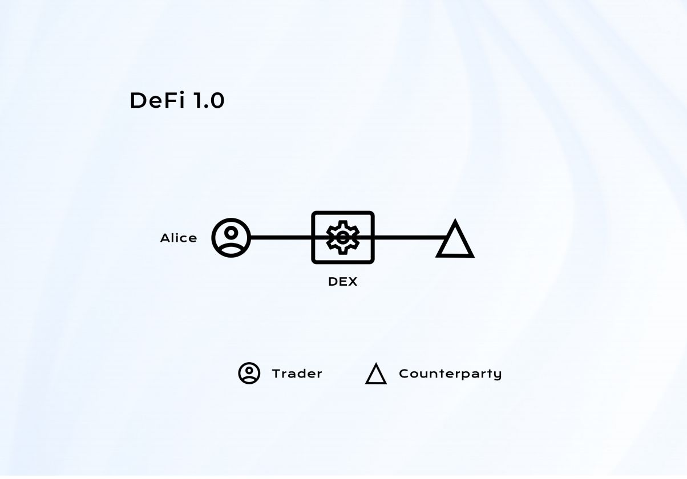

# FORT: A DeFi Development and Application System with Unlimited Liquidity

---

## Introduction

In the traditional financial market, i.e. CeFi (or "centralized finance"), financial intermediaries are responsible for maintaining the fairness of the trading; they are the deal makers who help the traders to find the matched counterparties. In other situations, they are also responsible for pricing financial products. The financial intermediaries include diverse exchanges and dealmakers of the loan and asset auction market. Together, they boost the efficiency of financial trading to the extreme. For instance, driven by high-frequency trading, the exchanges allow the frequencies of their order flow to arrive in nanoseconds. Although the traditional financial market has improved its efficiency, the credit risk within also increases. The inevitable hosting problem and the intervention of the financial intermediary will raise the implicit costs of financial transactions. These problems account for the main reason for developing DeFi (or "decentralized finance").

> Figure 1: Diagram of CeFi

If Alice, a trader, wants to buy, sell some asset, or open a position in a centralized Financial market; she needs to go to a financial intermediary, centralized exchange in this case. After filling her required trading in an order table, the exchange will public her order and find counterparties for Alice. The diagram of this process is exhibited in Figure 1.

DeFi is an umbrella term for financial services on public blockchains. With DeFi, participants can do most things that banks support, earn interest, borrow, lend, buy insurance, trade derivatives, trade assets, and more, but it's faster and doesn't require paperwork or a third party. As with crypto generally, DeFi is global, peer-to-peer (meaning directly between two people, not routed through a centralized system), pseudonymous, and open to all. 

The first generation of DeFi (DeFi 1.0) projects is based on the traditional approach of order books. For example, EtherDelta, the EtherDelta exchange, is a cryptocurrency trading platform based on the Ethereum blockchain and ERC20 standard tokens. It is worth noting that the exchange was established in Chicago in 2017. The platform is based on smart contracts, with the help of which all contracts are carried out inside the website (purchase, sale, withdrawal of funds from the wallet, etc.). Since every order has been written into a contract, waiting for counterparties, this approach is very inefficient and naturally creates a barrier to improving the market's liquidity. The problem of DeFi 1.0 includes

- the liquidity on the chain cannot be effectively ensured;
- finding the final matched counterparties still needed for centralized institutions;
- once a price deviates from the actual value, the gas fee cost of order adjustment
is high.

> Figure 2: Diagram of DeFi 1.0

This traditional financial approach is not appropriate for on-chain applications. We extend our story of Alice trying to trade with a DeFi 1.0 platform. She can participate in a smart contract that specifies her request and wait for counterparties to notice her order contract. The diagram of this process is exhibited in Figure 2.

The second generation of DeFi (DeFi 2.0) introduced automated market maker (AMM) model makes decentralized exchange (DEX, e.g., Uniswap, Sushiswap, etc.) possible and lending projects. DEXs have improved the liquidity of the DeFi contracts and allow users to deposit tokens to earn trading fees. lending projects (e.g., Aave, Compound, etc.) provide the users a platform to earn from providing liquidity and to borrow. Projects like MakerDao vitalize the DeFi market by allowing users to generate a kind of decentralized stablecoin. This kind of stablecoin is available to anyone, anywhere; like Dai (generated by MakerDAO) is backed by a surplus of collateral that has been individually escrowed into audited and publicly viewable Ethereum smart contracts. DeFi 2.0 led to a rising wave in the crypto market in 2020 since DeFi 2.0 projects provided a better solution to the fundamental problem of the DeFi industry: lack of liquidity.

> Figure 3: Diagram of DeFi 2.0

With a DeFi 2.0 platform. Alice can directly trade assets with the asset pools deposited by liquidity providers by participating in a smart contract. The diagram of this process is exhibited in Figure 3.

However, whether it is AMM or liquidity pools, the solution to the liquidity problems is at the expense of the liquidity provider's flexibility: a liquidity provider needs to fix his trading strategy and bear the external market fluctuations. Once the price is favorable to the liquidity provider, the counterparty trader can opt to back out of the deal. Once an arbitrage opportunity appears, the arbitragers flock in and cause impermanent losses to the liquidity providers. The liquidity providers has no choice but to hop for subsidies from mining, and commission or interest earned can compensate their losses. Although this asymmetric design temporarily alleviates the liquidity shortage, it generates the following problems in the long run: Firstly, many assets are occupied and deposited in DeFi protocols. At the same time, only a small volume of transactions is supported, which results in resource wasting. Most of the total value locked (TVL) is still rushing to liquidity mining for profits. In the long term, the lower the capital utilization rate, the greater the loss of the intrinsic value of the DeFi products. Secondly, in the AMM, the core variables, such as asset price and interest rate, are related to the size of the pool. When the size is small, it is easy to create arbitrage opportunities by high volume trading on one hand, and it is difficult to attract many traders and lenders when the pool is not large enough on the other hand.  Moreover, DeFi products' composability and liquidity sharing are only at the technical level since the TVL of various DeFi platforms cannot be shared. This kind of liquidity created at the expense of sacrificing the liquidity providers’ flexibility is not a perfect idea under the decentralized architecture.

It is better to erase this asymmetry between liquidity providers and other traders. Creating a brand new form of Defi 3.0: the system plays the role of the counterparty to all traders. This idea complies with the decentralized spirit. Everyone is in the same position to gamble with the smart contract, whether the underlying asset is Bitcoin, Ethereum, or other crypto-assets. The system burns the tokens immediately after any participant pays the system tokens for some financial products, and minting system tokens will settle the income of the financial products. We call this model ILM (Infinite Liquidity Model). It frees us from the traditional financial trading models. It forms a new financial paradigm that not only ensures composability but also uniforms programmability for all DeFi products within the same framework.

> Figure 4: Diagram of DeFi 3.0

With Defi 3.0, Alice can now directly trade with the system by participating in a smart contract. The system will be her counterparty in this situation. The diagram of this process is exhibited in Figure 4.