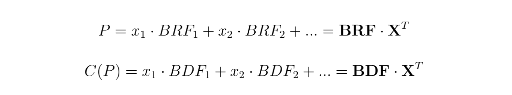

# FORT: A DeFi Development and Application System with Unlimited Liquidity

---

## Principles of FORT

The essence of any financial trading or financial product is a swap of different returns
with different risks, no matter the financial activity is an instant transfer, lending,
an option, or any complicated derivatives.

Consider stochastic processes $$\{S_2\}_{t \geq 0}$$ and $$\{r_t\}_{t \geq 0}$$ defined on ($$\Omega$$, $$\mathbb{P}$$, $$\mathcal{F}$$).
We use $$S_t$$ to describe the asset price and $$r_t$$ to describe the interest rate at time $$t$$.
Let $$\{\mathcal{F}_t\}_{t\geq 0}$$ be a filtration generated by $$S_t$$ and $$r_t$$.
It is the information stream of the market at time $$t$$. Consider a financial product which needs to be evaluated at time $$t=0$$. 
Denote $$R_t$$ the cash flow in at time $$t$$, and $$C_t$$ the cash flow out at time $$t$$. Let $$\tau _0$$ and $$\tau_1$$ be the time sets of
cash flow out and in respectively, then the diagram of financial products or derivatives can be illustrated as:

> Figure 5: Diagram of financial products or derivatives

The principle of FORT is that, according to a given discounting algorithm, any financial products or derivatives can be decomposed into a stream of cash flow in and a stream of cash flow out.
The cash flow in is the return of the financial product, and the cash flow out is the cost of the product.
Moreover, the sum of the expectation of discounted future cash flow in streams is equal to or slightly smaller (in the case for deflation) than the sum of the expectation of discounted current cash flow out streams are equivalent.
Both cash flow in and out are uniformly paid by the decentralized currency unit (DCU).
With respect to the sigma algebra $$\mathcal{F}_0$$ at time $$t=0$$, the time of the evaluation, this process can be described as following:

Since a financial product can consist of a linear combination of basic revenue functions (BRF),
each of which corresponds to a basic discount function (BDF), the cost of the product is a linear
combination of these basic discount functions. Thus, we can design the basic revenue function
and its discount function as a developable model: a discounted computer - any financial product
can be developed by this computer, and the basic revenue function is like the instructions of
the computer. The basic discount function is like the cost of these instructions or EVM-like gas,
except that the gas is paid in DCUs, and the instructions produce DCUs. The calculation of the
financial product P and its cost C(P) can be described as:

$$\mathbf{X}$$ is the linear combination coefficient of the $$\mathbf{BRF}$$ representation and $$\mathbf{BDF}$$ is the discount function of the $$\mathbf{BRF}$$, where

The discounted computer can develop a variety of financial products, including
options, perpetuals, leveraged trading, swaps, and lending products, to name just a
few, and almost any financial product can be produced.

### DCU Issuance, Settlement and Pricing

Decentralized Currency Unit (DCU) is issued by FORT protocol and has an unlimited supply, with the initial DCU offering of no more than 100 million.
In FORT protocol, DCU is the only currency for cash settlement.
For example, when a participant into a contract, which assures the participant to receive a certain amount of DCU after a certain number of blocks if the underlining asset price meet some certain conditions within the blocks.
In order to get into this contract, the participant needs to pay DCUs to the system, and the system will burn the tokens immediately after receiving them.
If the condition have been met, the system will mint new DCUs and pay the participant with them.

As readers can see, all DCU holders share the risks and benefits of DCU issuance or destruction and participate in the equilibrium of supply and demand in the secondary market for DCUs: the
demand for DCUs is from those who buy financial products on the chain and invest in DCUs, while the supply is determined by the initial offering and the DCUs settled by the FORT protocol.
The advantage of sharing the same settlement unit is that we can build all financial services such as trading, lending, derivatives without issuing too many tokens through continuously improving the liquidity of DCUs.

According to

Total discounted supply $$G_y$$ satisfies:

Total demand ($$D_t$$) is determined by trading demand, and the price of DCUs ($$P_t$$) is determined by the equilibrium of ($$D_t$$, $$G_t$$).
Considering the growth of demand and the long-term deflationary nature of supply, there is a logic for a sustained rise in $$P_t$$.

As the DCU is named, combined with FORT contracts, it is an on-chain universal currency with scenarios, which BTC and ETH cannot achieve:
BTC has no on-chain scenarios with fixed issuance, ETH follows all scenarios as gas, but its issuance is according to a fixed algorithm, not incremental according to scenarios.
DCU is guaranteed to clear in every scenario, which matches the completely decentralized currency envisioned by many economists, and is a further development after BTC-ETH.

### The Oracle

The decentralized oracle adopted follows this idea: given an on-chain price
stream, how to design a decentralized game such that the game equilibrium can output a price
stream with the smallest possible deviation from the on-chain price stream. The oracle solves
this problem with quotation mining, two-way options, validation cycles, price chains and $$\beta$$ factors. The oracle provides a price sequence that does not change the distribution of asset prices, but
approaches a discrete sampling model, which is determined by the structure of the decentralized
game, where the quote deviation and quotation density depend on the depth of the arbitrage
market and the price of the oracle token. Overall, the oracle provides an efficient decentralized way
that maintains the fundamental traits of asset prices.
In FORT, we tend to use highly efficient market prices, and hence choose the most liquid underlying assets such as BTC and ETH, etc. 
The basic price model follows the Geometric Brownian Motion (GBM) model. Considering the characteristics of prices deviation and discrete time, we
correct the prices using the $$k$$-factor as follows,

where $$p_2$$ and $$p_1$$ represent the current and previous prices respectively, $$t$$, measured by second, represents the difference between the time transaction happens and the time $$p_2$$ becomes effective. Furthermore, $$\sigma$$ the instantaneous volatility follows

The correct procedure follows

- when it comes to a call option, the long price is $$(1+k)p$$ while the short price is $$\frac{p}{1+k}$$
- when it comes to a put option, the long price is $$\frac{p}{1+k}$$ while the short price is $$(1+k)p$$

where $$p$$ represents the base price. 

### Time Domain

The time domain denoted by $$\tau_0$$ and $$\tau_1$$ can be instants or intervals.
A moment can be a definite moment or a random moment (e.g., a stoppage), and in finance, an interval is often used to determine some mean or stoppage.
Although the time on the blockchain is discrete, these discrete differences can be ignored for a longer period and compensated for in a shorter period based on
the $$k$$-factor, and thus can be interpreted approximately in terms of continuous time intervals.

### Discounted Computers

We abstract all financial products (services) as an exchange of revenue streams and
expenditure streams, and the revenue streams are represented by linear combinations
of the basic revenue functions. Then any financial product development only needs
to determine the linear combination of basic revenue functions to obtain its cost
(present value) by the linear combination of basic discount functions. Such linear
combinations are the same as we use computer programming, therefore we call
this figuratively as the discounted computer. Any financial product corresponds to
a piece of computer programming, so that the composable DeFi becomes program
designing and calling in the same framework, reducing the difficulty of understanding
and risk management.

### Basic Revenue Function and Discount Function

The basic revenue function (BRF) can be a deterministic value (e.g., block 13678933 to get 1000
DCUs) or it can be a random variable after introducing the oracle price information. Here,
we consider the basic types of deterministic values, random variables of pricing oracle,
and probability random variables, each of which consists of polynomial functions, exponential
functions, logarithmic functions, absolute value functions, maximum-minimum functions, and
definite integral operators. The base discount function (BDF) contains normal distribution functions, polynomial functions, exponential functions, logarithmic functions, etc. Considering that
the reality does not need so many revenue functions as well as the complexity of the calculation,
we choose a relatively simple list of functions, which can be gradually improved later. As mentioned earlier, the basic revenue function is the basic instructions of the discounted computer
while a financial product is a program which is a combination of these instructions.

### Discount Rate and Interest Rate Oracle

In principle, the discount rate reflects the risk-free return of the on-chain world. We can choose a risk-free interest rate statistic on the chain such as the PoS yield of ETH or the decentralized
interest rate oracle (a design as follows: given the number of DCU issues per year, anyone who locks DCUs can share these tokens proportionally) as the discount rate.
However, this paradigm is more suitable for a traditional centralized world. 
In a decentralized world, we can take the discount rate to a relatively small value, even zero, in order to give the DCU deflationary properties and thus ensure a steady rise in the DCU price.

### Pricing Unit Transformation

If a fiat or ETH is required as the numeraire in FORT, it is sufficient to introduce the DCU/USDT
or DCU/ETH price, which can be obtained through the oracle. If the liquidity of DCU is
large enough that the settlement of a single financial product has little impact on the price, the
financial product with the introduced price is no different from the traditional financial product.
The pricing based on the risk-neutral measure ($$\mathbb{E}^Q$$) can perfectly solve the calculation of the
discount function, which can be used for hedging or asset portfolio management.

### Financial Product Development

The development of a financial product in FORT is the same as writing smart contracts, i.e., finding
a vector with BRF as the base for the target return, and that vector represents this financial
product. The product of that vector and the corresponding BDF base is the cost of the financial
product, i.e., it is only necessary to pay this cost in the time domain $$\tau_0$$ to obtain the financial product.
That financial product will get the DCUs minted by the FORT contract in the time
domain $$\tau_1$$, and its quantity is the product of that vector and the BRF. This process is just like
writing smart contracts by which all financial products can be implemented with the discounted
computer programming of FORT. Developers do not have to operate the liquidity of tokens, and
just need the DCUs to be liquid enough.