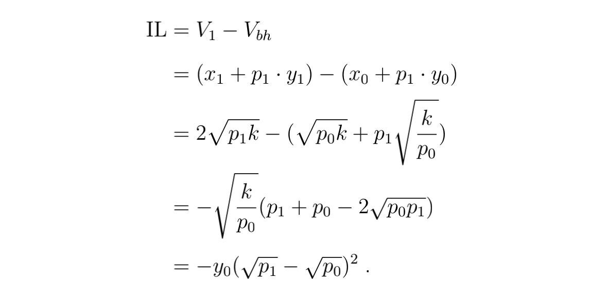

# FORT: A DeFi Development and Application System with Unlimited Liquidity

---

## Summary

FORT offers a new paradigm: financial products are considered as programming over basic discount functions.
The cost is the expense of calling those functions, just like EVM. The difference
is that the economic relations of the discounted computer are inherent. The new paradigm can
cover almost all financial products (services) which can be bought at any time and settled with
unlimited liquidity, where market makers, margin (call), and fear of being unable to settle are
not required. As long as the DCU liquidity is sufficient, it would be extremely easy to recreate
the traditional financial market. Moreover, as difficulties of issuance and settlement are solved,
traditional derivatives exchanges can focus on the secondary market, thus significantly reducing
their costs. In addition, FORT can bring the fundamental consistent variables for the metaverse,
with the ability to traverse different games to lock in economic relationships.

## A The Mathematical Procedure to Compute IL

Using the notations in defined in the main context, according to

we have

Thus, IL follows

